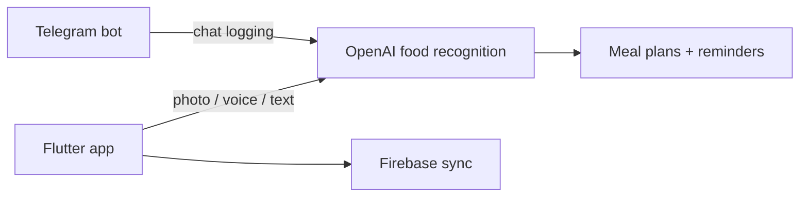

# ProCal — Showcase

> 🔒 **Source is private** (part-time role; owned by employer). Happy to walk through the architecture in an interview.

AI nutrition coach: log meals by **photo, voice, or text**, get OpenAI-powered food recognition, personalized meal plans, and smart reminders — with a companion **Telegram bot** for chat-based logging.

## Overview

AI nutrition coach (Flutter): log meals by photo, voice, or text with OpenAI food recognition, meal plans, reminders, Firebase sync, and a Telegram companion bot.

## Links

- **Live:** https://procal.food/
- **Google Play:** https://play.google.com/store/apps/details?id=co.willpowerventures.pro_cal&hl=en
- **This repo:** portfolio write-up only — no application source

## Role

**Assistant developer** — Flutter mobile app + Telegram bot companion (AI-assisted meal logging workflow).

## Key Features

- OpenAI-assisted food recognition from meal photos
- Voice and text logging alongside photo capture
- Personalized meal plans and smart reminders
- Firebase-backed sync
- Telegram bot for chat-based logging

## Tech stack

| Layer | Stack |
| :--- | :--- |
| Mobile | Flutter, Dart |
| AI | OpenAI API, `speech_to_text` |
| Backend / sync | Firebase |
| Bots | Telegram Bot API |

## Dependencies

No installable source in this showcase. Product stack: Flutter, Dart, OpenAI API, Firebase, Telegram Bot API, speech_to_text.

## How to run locally

Source is private (employer-owned). Use the live app / Play Store links above — there is nothing to run from this repo.

## Architecture (high level)

## Screenshots

<!-- Add 2–4 product screenshots under docs/screenshots/ when available -->

## Source

No source is published here. Product rights remain with the owning employer.
