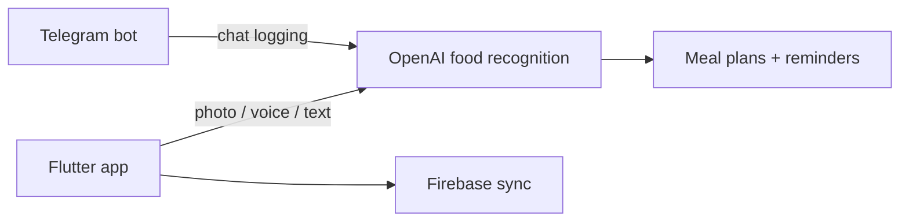

# ProCal — Showcase

> 🔒 **Source is private** (part-time role; owned by employer). Happy to walk through the architecture in an interview.

AI nutrition coach: log meals by **photo, voice, or text**, get OpenAI-powered food recognition, personalized meal plans, and smart reminders — with a companion **Telegram bot** for chat-based logging.

## Links

- **Live:** https://procal.food/
- **Google Play:** https://play.google.com/store/apps/details?id=co.willpowerventures.pro_cal&hl=en
- **This repo:** portfolio write-up only — no application source

## Role

**Assistant developer** — Flutter mobile app + Telegram bot companion (AI-assisted meal logging workflow).

## What it does

- OpenAI-assisted food recognition from meal photos
- Voice and text logging alongside photo capture
- Tracks protein/calories; personalized meal plans and reminders
- Firebase-backed sync across sessions
- Telegram bot extends the same AI workflow for chat-based interaction

## Tech stack

| Layer | Stack |
| :--- | :--- |
| Mobile | Flutter, Dart |
| AI | OpenAI API, `speech_to_text` |
| Backend / sync | Firebase |
| Bots | Telegram Bot API |

## Architecture (high level)

## Screenshots

<!-- Add 2–4 product screenshots under docs/screenshots/ when available -->

## Source

No source is published here. Product rights remain with the owning employer.
